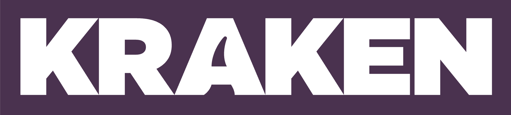

Kraken is the most-loved and proven operating system for energy. Powered by Utility-Grade AI® and deep industry know-how, we help leading utilities like EDF, Octopus Energy, E.ON Next, Origin, Tokyo Gas and National Grid boost efficiency by up to 40%, triple customer satisfaction, and increase innovation and grid flexibility.

Our technology delivers better outcomes from generation through distribution to supply, across 90+ million accounts worldwide. With a proven record for fast, seamless migrations, Kraken is on a mission to make a big, green dent in the universe.

## Links  

- [Kraken Tech](https://kraken.tech/)
- [Kraken Tech Engineering Blog](https://engineering.kraken.tech/)
